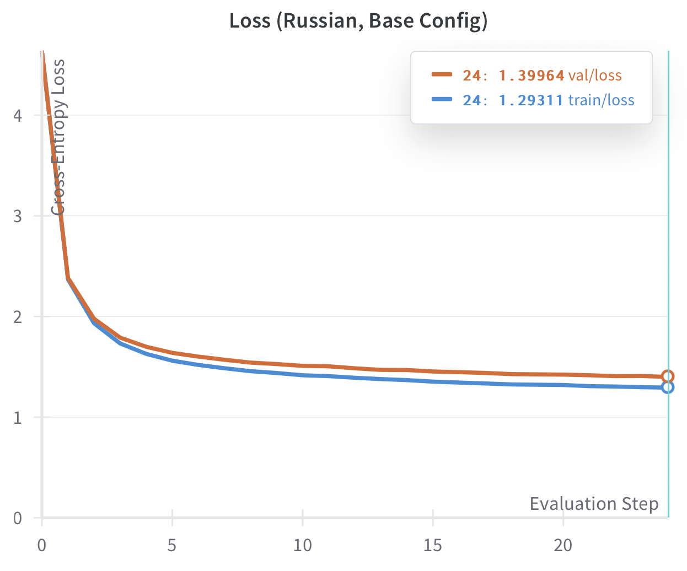
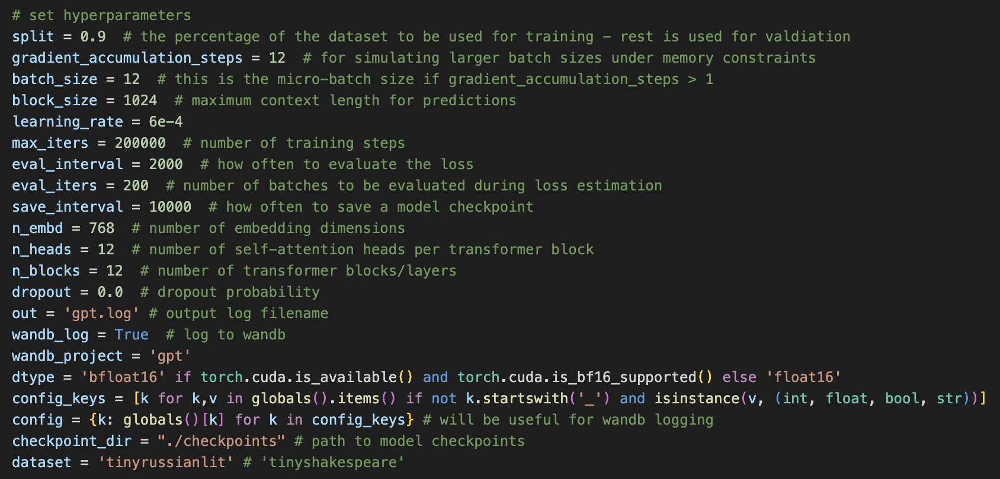
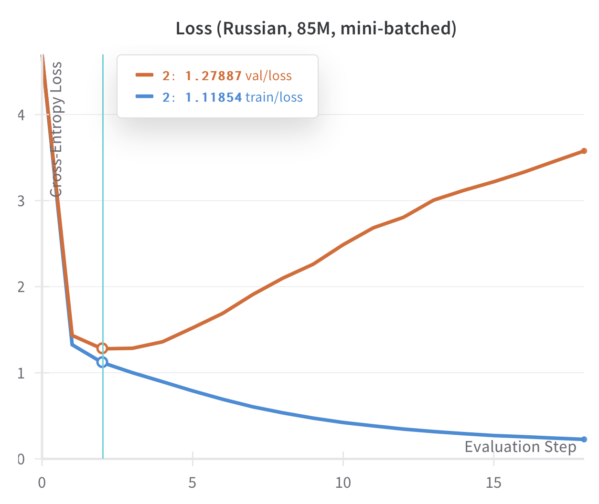

# SlavicGPT
Building, training, and fine-tuning of medium-sized GPTs on Russian text and Slavic literature.


## Initial Experiments

`dev.ipynb` contains my initial experiments with the bigram model, a simple baseline language model, as well as my exploration into developing a more powerful model that can capture complex dependencies between tokens via self-attention.

### 10.8M Parameter Character-Level Model
In `gpt.py`, I took what I learned to build a character-level, transformer-decoder language model based on OpenAI's GPT architecture. I trained it on Russian text obtained from various genres and authors in the classic Russian literary canon—poetry, prose, and publicism from 12 different authors including Tolstoy, Dostoevsky, and Pushkin. I wrote `retrieve_russian_text.py` to process this set of literary works into one text file and clean it to remove garbage characters and sequences. I used my resulting `data/tiny-russian-lit/very_clean_tiny_russian_lit.txt` file as the dataset for this first experiment. This dataset has ~34.8 million characters (for a character-level model, this is also the total number of tokens) and a vocabulary size of 87.

My language model for this experiment had ~10.8 million parameters.

Given a newline character as the starting context, the untrained model (with validation loss ~4.64) generated the following sample:
```
Т?лШ:д&;Нбл-—уЁпЮчЧ;кМлИыАлЦІ:аьлЫрЫгбБдлчІЖЫБдБ—хХы?дАЪЉ!ы?кГЮ́д
І!ДДХ
ъуіИЬшев шИЩл!ш,йдАЁкдеФЩЛІѝщ
вжчкЬОП;ІвКогыЙъ́о&ЙюдЕЦ—КЮ.И,ш.Ъ—ныАЕЯч̀бЦмцЗ–ЉцзЪiєЦрА?шєфАХэыюХзрЧшИЮв.х
С?̀Я,-іiщi!аЯєИЙАЉГДЗЗж&е’ЖдЕЗх &ЗІЉъъЉП—ЖнукИЙе́Хи’ыёАшлУЗ ЮєСжБТлУ.ЗЮ
```
Gibberish, as expected.

After training for ~15 minutes (comprising 12,000 training steps) on one A100 GPU, the model achieved a best validation loss of ~1.40.

Here is the loss profile of the training run:



The loss profile suggests underfitting, and with more training, I would expect only very slight improvements in performance. The model's small size means it may not have the capacity to learn deeper patterns underlying a sufficiently large language dataset. We see this as the model struggles to achieve good performance even after many iterations.

The trained model generated the following sample:
```
Кто-то сдал Катерин.
Ах, совсем не надобится Чичиков
На любовь!,
И, высказал ему обоим расставшиеся от этого, отдал отректы, слоймуны, поднимувшиеся знакомые вам,
на рубище, не об уставшей на бытую, но весело
изъявил ей.
Любовь, к своему важного учти
```
This is starting to look like Russian. We also see Чичиков (Chichikov) from Gogol's Dead Souls make an appearance! But the sample is still pretty nonsensical if you actually read (or try to translate) it. Nevertheless, by training a little bit on our relatively small Russian literature dataset, this initial model has clearly learned some level of patterns and dependencies in the Russian language and how tokens 'communicate' across a sequence.

### 85.9M Parameter Character-Level Model

I then scaled up the model, increasing `block_size` (context length), `n_embd` (hidden dimension), `n_heads` (number of self-attention heads per transformer block), and `n_blocks` (number of transformer blocks). I also made use of mini-batching during training via a `gradient_accumulation_steps` greater than 1. Here is the full config for this model:



For this experiment, I utilized distributed training via PyTorch's `DistributedDataParallel` library. After training on four A100 GPUs for ~1 hour, the model achieved a best validation loss of ~1.28, an improvement from ~1.40. The train loss at this point was ~1.12.

After continuing training for ~8 more hours, the model achieved a train loss of ~0.27 and a validation loss of ~3.22, suggesting heavy overfitting to the training data.

Below is the loss profile for the training run:



With an increased number of parameters, the model has a higher capacity to fit to noise and 'memorize' training data; it can learn more complex patterns, but there is also a greater risk of capturing details specific to just the train set. We see this as the model's performance on the unseen data in the validation set quickly worsens after the second evaluation step, while performance on the training set keeps improving.

The model produced the following sample at the checkpoint with train loss 1.12 and val loss 1.28:
```
Новожички, приходившие к нам этапный из ворот, и
наивно торопились запыхаться. Через минуту он раза подходил в котла,
останавливался боком против их подлинной. Глухо дышал отослать книзу,
задорнал впечатление души, по глубокому убеждению, были переме
```

The language is still disjointed and contains strange constructions and unusual words. For instance, 'Новожички' is not a standard word in Russian but most closely resembles 'новички,' meaning 'newcomers.'


The model produced the following sample at the checkpoint with train loss 0.27 and a val loss 3.22:
```
Но дружно, чтоб отвлекать по этим вопросам, что я мог возненавидеть его.
Я забыл тоже, как слова мои мысли и чувства упорно силились взглянуть на лицо женщины.
Глаза девственно огонь Мозглякова загорелись, и чтоб успокоиться его взгляда на женщину св
```

As expected, this sample is more coherent than the first sample. The low training loss suggests that the model has learned to reproduce the patterns in the training data with high accuracy, while the increased validation loss suggests it has done so by fitting to noise and sequences in the training data that do not generalize to the validation set. The sample still has awkward phrases and some convoluted sentences, making the overall meaning difficult to grasp.

Interestingly, the samples feature very poetic and abstract language, with striking—though strange and confusing—imagery and metaphors. This makes sense: the tinyrussianlit dataset is a literary dataset, containing highlights of Russian poetry and other works that are not straightforward prose.

## In Progress

- Instead of the current character-level model, where we map individual characters to integers, use a Byte Pair Encoding tokenizer implementing a subword segmentation algorithm. This should lead to improved generalization, since a subword tokenizer can capture meaningful linguistic structures, such as prefixes, suffixes, and common roots. The model can then represent rare words and generalize to unseen words by reusing common subword patterns learned during training.
- Build a Reddit scraper for extracting online, conversational Russian text (see `scrape` dir) and continue developing the tinyrussianlit dataset to make it more representative of the distribution of Russian language by adding diverse examples. Important: Ensure that the validation set accurately reflects the distribution of data in the training set.

## Acknowledgments

Many thanks to Andrej Karpathy for his amazing [tutorial](https://www.youtube.com/watch?v=kCc8FmEb1nY) and [nanoGPT](https://github.com/karpathy/nanoGPT) repo, which have been great educational resources for me as I work on this project.